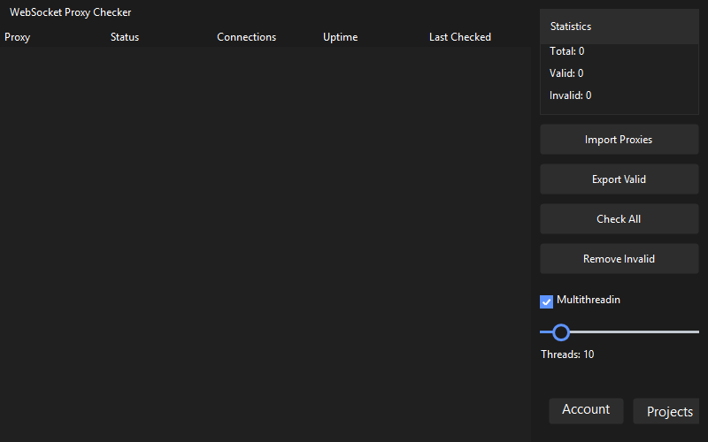

# WebSocket Proxy Checker


A Windows Forms application built with .NET 8.0 for managing and checking WebSocket proxies through Glitch.com projects.

## Features

- Create and manage Glitch.com accounts
- Generate WebSocket proxies automatically
- Multi-threaded proxy checking
- Import/Export functionality for accounts and proxies
- Dark-themed modern UI using Guna.UI2.WinForms
- Built-in reCAPTCHA handling for account creation

## Prerequisites

- Windows 7 or later
- .NET 8.0 Runtime

## Dependencies

- Guna.UI2.WinForms (2.0.4.4)
- System.Management (7.0.0)

## Installation

1. Download the latest release
2. Extract all files to a directory
3. Run `WsProxyChecker.exe`

## Usage

### Account Management
1. Navigate to the Accounts section
2. Click "Copy Script" to get the reCAPTCHA handling script
3. Open your browser's console (F12)
4. Paste and run the script
5. Solve the reCAPTCHA that appears
6. Copy the generated token
7. Paste the token in the application and click "Create Accounts with Token"

### Proxy Generation
1. Go to the Projects section
2. Set the desired number of proxies per account using the slider
3. Click "Generate" to create new proxy projects
4. Use "Import/Export" buttons to save or load proxy lists

### Proxy Checking
- Enable/disable multithreading as needed
- Adjust thread count using the slider
- Click "Check All" to verify proxy status
- Use "Remove Invalid" to clean up non-working proxies

## Building from Source

1. Clone the repository
2. Open the solution in Visual Studio 2022
3. Restore NuGet packages
4. Build the solution

```csharp
dotnet restore
dotnet build
```

## License

This project is for educational purposes only. Use at your own risk and ensure compliance with Glitch.com's terms of service.

## Contributing

Pull requests are welcome. For major changes, please open an issue first to discuss what you would like to change.

## Disclaimer

This tool is not officially affiliated with Glitch.com. Use responsibly and in accordance with Glitch's terms of service.
